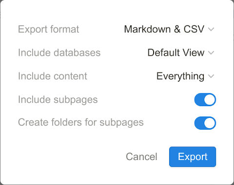

# Tutorial for LangChain

Adopted based on Patrick Loeber's YouTube tutorial. [YouTube URL](https://youtu.be/LbT1yp6quS8?si=kO0KLlVBKLG-biAP)

## Install required packages

Note: Faiss (Facebook AI Similarity Search) requires CUDA to run.

Replacing `faiss-gpu` to `faiss-cpu`, if running the code without a Nvidia card.

```bash
pip install -r requirements.txt
```

## Environment Variables

Environment variables are required for OpenAI and HuggingFace.
Create a `.env` with the following environment variables and replace the `<...>` with your keys.

```bash
OPENAI_API_KEY=<OEPNAI_PRIVATE_KEY>
HUGGINGFACEHUB_API_TOKEN=<HUGGINGFACEHUB_API_TOKEN>
```

For `LangChain2.ipynb`, in addition to the keys above you also need:

```bash
PINECONE_API_KEY=<PINECONE_API_KEY>

```

I named the indexes for the Pinecone AI agent: `langchain-demo`.

## Notion Loader

The Notion data loader example requires to download a notion page from one of your [Notion.so](Notion.so).

Click the triple dots button from the top right corner, select `Export`, then make sure `Markdown & CSV` and `Default View` are selected. The `Current View` may not include the `*.md` files.


